# HosPulse: System Architecture

## Project idea

> HosPulse: early-warning intelligence for companies that manage rural hospitals (first customer: a rural hospital management company in Oklahoma that manages multiple rural/critical access hospitals and does turnarounds). Phase 0: a free "Health Snapshot" built on public CMS HCRIS cost report data showing any rural hospital's margins, days cash on hand, A/R days and trends. Phase 1-2: management company uploads monthly non-patient financial/operational exports (GL, A/R aging, denials summary, staffing) from each managed hospital; system normalizes them across different hospital systems, computes KPIs, detects early-warning signals, and an AI agent (Claude) writes a weekly plain-English "hospitals at risk" briefing for operators. Phase 3: cost report co-pilot to find missed reimbursement. Hard constraint: no patient data (PHI). Low cost, maintained by Claude Code as the engineering team, solo founder.

## Diagram

```mermaid
flowchart LR
    CMS[(CMS HCRIS public cost report files)]
    Visitor([Public visitor])
    Operator([Management company operator])

    subgraph P0[Phase 0: Free Health Snapshot]
        Importer[HCRIS Importer]
        Snapshot[Public Health Snapshot Page]
    end

    subgraph P12[Phase 1-2: Operator early warning]
        Portal[Operator Portal]
        Access[Access Control]
        Intake[Upload Intake + PHI Guard]
        Files[(Export File Storage)]
        Normalizer[Normalizer]
        Engine[KPI + Early-Warning Engine]
        Briefing[AI Briefing Agent - Claude]
        Email[Email Delivery Service]
    end

    subgraph P3[Phase 3]
        CostPilot[Cost Report Co-pilot - Claude]
    end

    DB[(Metrics Database - relational)]
    Scheduler[Scheduler]

    Scheduler -->|"quarterly: trigger refresh"| Importer
    CMS -->|"public cost report files"| Importer
    Importer -->|"per-hospital yearly financials"| DB
    Visitor -->|"search a hospital"| Snapshot
    Snapshot -->|"query public metrics"| DB
    DB -->|"margins, days cash, A/R days, trends"| Snapshot

    Operator -->|"sign in"| Access
    Access -->|"session limited to own hospitals"| Portal
    Operator -->|"monthly exports: GL, A/R aging, denials, staffing"| Portal
    Portal -->|"uploaded files"| Intake
    Intake -->|"rejected: file looks like patient data"| Portal
    Intake -->|"accepted raw file"| Files
    Files -->|"raw export"| Normalizer
    Normalizer -->|"standardized monthly metrics per hospital"| DB
    Scheduler -->|"weekly: run analysis"| Engine
    DB -->|"history + public benchmarks"| Engine
    Engine -->|"KPIs + early-warning signals"| DB
    Engine -->|"flagged hospitals + evidence"| Briefing
    Briefing -->|"plain-English briefing"| DB
    Briefing -->|"weekly briefing"| Email
    Email -->|"hospitals at risk email"| Operator
    DB -->|"dashboards + past briefings"| Portal

    Operator -->|"request cost report review"| Portal
    Portal -->|"hospital + fiscal year"| CostPilot
    DB -->|"cost report lines + ledger totals"| CostPilot
    CostPilot -->|"possible missed reimbursement items"| Portal
```

## Components

### CMS HCRIS public cost report files
The free government dataset where every Medicare hospital's yearly cost report is published, which is the raw material for the free Health Snapshot.

### HCRIS Importer
A scheduled job that downloads those public files and turns them into clean yearly numbers per hospital (margins, days cash on hand, A/R days).

### Public Health Snapshot Page
A free public web page where anyone can look up a rural hospital and see its financial health and trends, which doubles as the marketing demo.

### Public visitor
Anyone, such as a hospital executive who found a LinkedIn post, who looks up a hospital on the free snapshot without an account.

### Management company operator
The customer (for example a management company executive) who uploads monthly exports, reads the dashboards, and receives the weekly briefing.

### Access Control
The sign-in layer that makes sure each management company only ever sees data for the hospitals it manages.

### Operator Portal
The private web app where operators upload monthly files, view each hospital's dashboard, read past briefings, and request cost report reviews.

### Upload Intake + PHI Guard
The front door for uploaded files that checks each file's format and rejects anything that looks like patient data (names, birth dates, record numbers) before it is stored.

### Export File Storage
A private file store that keeps each accepted raw export so the numbers can always be traced back to, and re-processed from, the original file.

### Normalizer
The translator that converts exports from different hospital billing and accounting systems into one standard set of monthly numbers per hospital.

### Metrics Database (relational)
A relational database (for example Postgres) that holds every hospital's monthly and yearly numbers, the computed warning signals, and the written briefings in structured tables.

### Scheduler
The timer that kicks off the quarterly public data refresh and the weekly analysis and briefing run.

### KPI + Early-Warning Engine
Deterministic code (fixed rules, not AI) that calculates the key numbers for each hospital and flags worrying trends, such as falling cash or rising denials, compared with that hospital's own history and similar hospitals.

### AI Briefing Agent (Claude)
The AI writer that turns the engine's flagged hospitals and supporting numbers into a short plain-English "hospitals at risk" briefing, using only numbers the engine already computed so it cannot invent figures.

### Email Delivery Service
An outside email provider that sends the weekly briefing to each operator's inbox.

### Cost Report Co-pilot (Claude), Phase 3
An AI assistant that compares a hospital's cost report against its accounting totals and lists possible missed reimbursement items for a human reimbursement expert to confirm.
